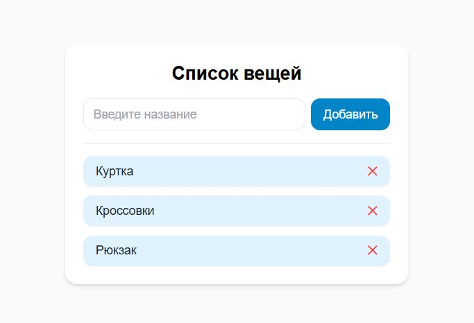

# Список вещей 


Простое приложение на **React + TypeScript** для управления списком вещей.  
Можно **добавлять новые элементы**, **удалять существующие**, а список сохраняется в **localStorage**.  

**Демо:** [list-of-things-ochre.vercel.app](https://list-of-things-ochre.vercel.app/)

---

## Возможности
- Отображение списка вещей (по умолчанию: Куртка, Кроссовки, Рюкзак)
- Добавление нового элемента через форму
- Удаление элемента из списка
- Сохранение данных в **localStorage**
- Простая анимация появления и удаления
- Современный интерфейс на **Tailwind CSS**
- Проект полностью на **TypeScript**
- Компоненты разделены для удобства (`ItemCard`, `AddItemForm`)

---

## Стек технологий

1. React

2. TypeScript

3. Tailwind CSS

---

## Запуск проекта

1. Установка зависимостей

```bash
npm install
```

2. Запустить локально

```bash
npm start
```

Проект будет запущен на http://localhost:3000/.